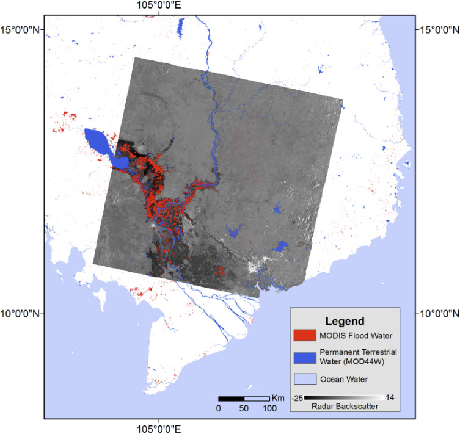
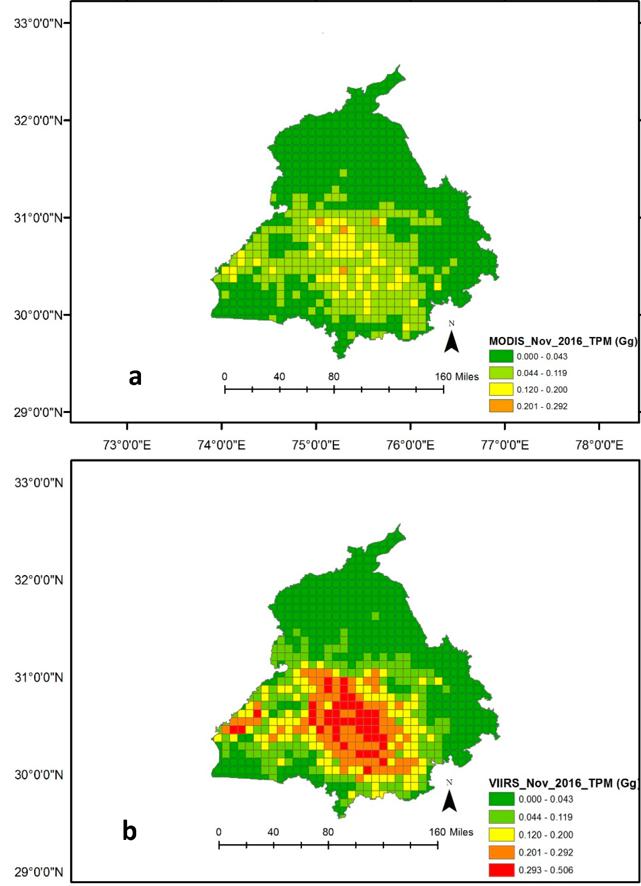

```{r echo = FALSE, message = FALSE, warning = FALSE}
library(countdown)
library(xaringan)
library(xaringanExtra)
library(knitr)

hook_source <- knitr::knit_hooks$get('source')
knitr::knit_hooks$set(source = function(x, options) {
  x <- stringr::str_replace(x, "^[[:blank:]]?([^*].+?)[[:blank:]]*#<<[[:blank:]]*$", "*\\1")
  hook_source(x, options)
})

xaringanExtra::use_broadcast()
xaringanExtra::use_freezeframe()
xaringanExtra::use_scribble()
#xaringanExtra::use_slide_tone()
xaringanExtra::use_search(show_icon = TRUE, auto_search	=FALSE)
xaringanExtra::use_freezeframe()
xaringanExtra::use_clipboard()
xaringanExtra::use_tile_view()
xaringanExtra::use_panelset()
xaringanExtra::use_editable(expires = 1)
xaringanExtra::use_fit_screen()
xaringanExtra::use_extra_styles(
  hover_code_line = TRUE,         
  mute_unhighlighted_code = TRUE  
)

```


# Introduction to MODIS

```{r setup, include=FALSE}
options(htmltools.dir.version = FALSE)
```

<iframe width="560" height="315" src="https://www.youtube.com/embed/1jqFxZI_2XY?si=ISXHbQpVC5JAT5A8" title="YouTube video player" frameborder="0" allow="accelerometer; autoplay; clipboard-write; encrypted-media; gyroscope; picture-in-picture; web-share" allowfullscreen></iframe>

---

# Key Facts about MODIS

--

* MODIS: Moderate-resolution Imaging Spectroradiometer

--

* Acquire data related to processes in the land, sea and lower atmosphere to better understand global dynamics

--

* Equipped on the Terra (EOS AM-1) and Aqua (EOS PM-1) satellite launched in 1999 and 2002 respectively

--
```{r echo = FALSE, message = FALSE, warning = FALSE}
library(tidyverse)
library(knitr)
library(kableExtra)
library(readxl)
library(fs)
library(here)

read_excel(here("W2Image", "Resolution.xlsx"))%>%
  # booktab = T gives us a pretty APA-ish table
  knitr::kable(booktabs = TRUE)%>% 
  kable_styling(position = "center")%>%
  # any specifc row changes you want
    row_spec(.,
  row=0,
  bold = TRUE)
```


---
# MODIS Applications and Associated Bands 1

.panelset.sideways[
.panel[.panel-name[Land / Cloud / Aerosols Boundaries]
```{r echo=FALSE}
#read in data
read_excel(here("W2Image", "Bands.xlsx"), sheet=1)%>%
  # booktab = T gives us a pretty APA-ish table
  knitr::kable(booktabs = TRUE)%>% 
  kable_styling(position = "center")%>%
  # any specifc row changes you want
    row_spec(.,
  row=0,
  bold = TRUE)
```

]

.panel[.panel-name[Land / Cloud / Aerosols Properties]
```{r echo=FALSE}
#read in data
read_excel(here("W2Image", "Bands.xlsx"), sheet=2)%>%
  # booktab = T gives us a pretty APA-ish table
  knitr::kable(booktabs = TRUE)%>% 
  kable_styling(position = "center")%>%
  # any specifc row changes you want
    row_spec(.,
  row=0,
  bold = TRUE)
```

]
.panel[.panel-name[Ocean Colour / Phytoplankton / Biogeochemistry]
```{r echo=FALSE}
#read in data
read_excel(here("W2Image", "Bands.xlsx"), sheet=3)%>%
  # booktab = T gives us a pretty APA-ish table
  knitr::kable(booktabs = TRUE)%>% 
  kable_styling(position = "center")%>%
  # any specifc row changes you want
    row_spec(.,
  row=0,
  bold = TRUE)
```

]
.panel[.panel-name[Atmospheric Water Vapour]
```{r echo=FALSE}
#read in data
read_excel(here("W2Image", "Bands.xlsx"), sheet=4)%>%
  # booktab = T gives us a pretty APA-ish table
  knitr::kable(booktabs = TRUE)%>% 
  kable_styling(position = "center")%>%
  # any specifc row changes you want
    row_spec(.,
  row=0,
  bold = TRUE)
```

]
.panel[.panel-name[Surface / Cloud Temperature]
```{r echo=FALSE}
#read in data
read_excel(here("W2Image", "Bands.xlsx"), sheet=5)%>%
  # booktab = T gives us a pretty APA-ish table
  knitr::kable(booktabs = TRUE)%>% 
  kable_styling(position = "center")%>%
  # any specifc row changes you want
    row_spec(.,
  row=0,
  bold = TRUE)
```

]

]

---
# MODIS Applications and Associated Bands 2

.panelset.sideways[
.panel[.panel-name[Atmospheric Temperature]
```{r echo=FALSE}
#read in data
read_excel(here("W2Image", "Bands.xlsx"), sheet=6)%>%
  # booktab = T gives us a pretty APA-ish table
  knitr::kable(booktabs = TRUE)%>% 
  kable_styling(position = "center")%>%
  # any specifc row changes you want
    row_spec(.,
  row=0,
  bold = TRUE)
```

]
.panel[.panel-name[Cirrus Clouds Water Vapour]
```{r echo=FALSE}
#read in data
read_excel(here("W2Image", "Bands.xlsx"), sheet=7)%>%
  # booktab = T gives us a pretty APA-ish table
  knitr::kable(booktabs = TRUE)%>% 
  kable_styling(position = "center")%>%
  # any specifc row changes you want
    row_spec(.,
  row=0,
  bold = TRUE)
```

]
.panel[.panel-name[Cloud Properties]
```{r echo=FALSE}
#read in data
read_excel(here("W2Image", "Bands.xlsx"), sheet=8)%>%
  # booktab = T gives us a pretty APA-ish table
  knitr::kable(booktabs = TRUE)%>% 
  kable_styling(position = "center")%>%
  # any specifc row changes you want
    row_spec(.,
  row=0,
  bold = TRUE)
```

]
.panel[.panel-name[Ozone]
```{r echo=FALSE}
#read in data
read_excel(here("W2Image", "Bands.xlsx"), sheet=9)%>%
  # booktab = T gives us a pretty APA-ish table
  knitr::kable(booktabs = TRUE)%>% 
  kable_styling(position = "center")%>%
  # any specifc row changes you want
    row_spec(.,
  row=0,
  bold = TRUE)
```

]
.panel[.panel-name[Surface / Cloud Temperature]
```{r echo=FALSE}
#read in data
read_excel(here("W2Image", "Bands.xlsx"), sheet=10)%>%
  # booktab = T gives us a pretty APA-ish table
  knitr::kable(booktabs = TRUE)%>% 
  kable_styling(position = "center")%>%
  # any specifc row changes you want
    row_spec(.,
  row=0,
  bold = TRUE)
```

]
.panel[.panel-name[Cloud Top Altitude]
```{r echo=FALSE}
#read in data
read_excel(here("W2Image", "Bands.xlsx"), sheet=11)%>%
  # booktab = T gives us a pretty APA-ish table
  knitr::kable(booktabs = TRUE)%>% 
  kable_styling(position = "center")%>%
  # any specifc row changes you want
    row_spec(.,
  row=0,
  bold = TRUE)
```

]
]
---

# MODIS-based Automated flood monitoring system (Ahmad and Bolten, 2017)

.pull-left[Despite MODIS' lower spatial resolution of 250m compared to Landsat 8 of 30m, it has a higher temporal resolution of 1 to 2 days over the latter of 16 days. This makes it useful for disaster monitoring where events unfold quickly. Normalised Difference Vegetation Index (NDVI) was used to classify vegetation and agricultural areas and water under normal conditions and during flood events.MODIS imagery alongside hydrologic routing models and on ground observations could provide accurate and timely data during flood events to inform humanitarian efforts.]

.pull-right[
```{r echo=FALSE, out.width='100%', fig.align='center'}

```
Validation through spatial comparison of MODIS flood extent with ENVISAT ASAR imagery for 30th September 2011
]

---

# Comparison of MODIS AQUA and VIIRS Fire Product (Vadrevu and Lasko, 2018)

.pull-left[A comparison of VIIRS 375m active fire product and MODIS 1km fire product in an agricultural environment reveals that the former detects fires more accurately than the latter. However, as VIIRS data was only available since 2012 whereas MODIS Aqua was available since 2002,  both data were required to create a prediction model to estimate the potential total particulate matter emissions from 2003 to 2016.]

.pull-right[
```{r echo=FALSE, out.width='70%', fig.align='center'}

```
Comparison of total particulate matter emissions from MODIS (top) and VIIRS (bottom) for November 2016
]

---

# Reflection

* When I read the specs for MODIS, my initial reaction was why would anyone still want to use it today given its spatial resolution. Would it be useful for monitoring smaller features such as small streams or parks?

* However, I realised that in large study areas and depending on the research question, the spatial resolution of 250/500/1000m would be suitable. Other variables such as daily temporal resolution or high revisit frequency could be more important. MODIS has been around for approximately two decades and hence offers image comparisons over a longer timeframe compared to satellites that were launched more recently. Furthermore, MODIS has a large range of use cases such as observing changes in the polar ice cap, pollution, urban heat island effect and biogeochemistry.

* Despite the capabilities and richness offered by MODIS, it is important to realise that MODIS’ lifespan is reaching its end soon (Tang et al., 2020). Efforts to ensure data continuity and compatibility with newer satellite missions will be essential for a comprehensive understanding of the Earth system over time.


---


# References

Ahamed, A. and Bolten, J. D. (2017). ‘A MODIS-based automated flood monitoring system for Southeast Asia’. International Journal of Applied Earth Observation and Geoinformation, 61, pp. 104–117. doi: 10.1016/j.jag.2017.05.006.

Krishna, V. and Lasko, K. (2017). ‘Intercomparison of MODIS AQUA and VIIRS I-Band Fires and Emissions in an Agricultural Landscape—Implications for Air Pollution Research’. Remote Sensing, 10 (7). doi: 10.3390/rs10070978.

MODIS Web. (n.d.a). ‘About’. Available at: https://modis.gsfc.nasa.gov/about/index.php (Accessed: 31 January 2024).

MODIS Web. (n.d.b). ‘Specifications’. Available at: https://modis.gsfc.nasa.gov/about/specifications.php (Accessed: 31 January 2024).

NASA | Aqua MODIS: Science and Beauty. (2012). Available at: https://www.youtube.com/watch?v=1jqFxZI_2XY (Accessed: 31 January 2024).

Tang, X., Bullock, E. L., Olofsson, P. and Woodcock, C. E. (2020). ‘Can VIIRS continue the legacy of MODIS for near real-time monitoring of tropical forest disturbance?’ Remote Sensing of Environment, 249. doi: 10.1016/j.rse.2020.112024.

---

class: center, middle

# Thank You

